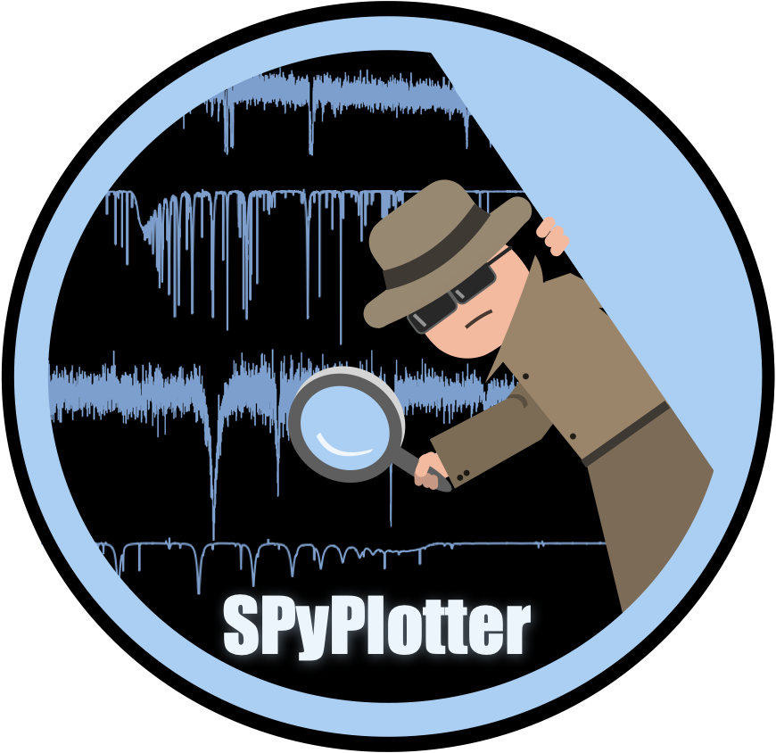

# spyplotter
<p align="center"> 

This package provides tools for quantitative spectroscopy, including the analysis of observed data and the visualization of outputs from stellar atmosphere models such as PoWR and CMFGEN.

It is inspired by [WRplot](https://www.astro.physik.uni-potsdam.de/~htodt/wrplot/index.html) and brings similar functionality into a flexible Python-based workflow.

## Installation
After cloning this directory, the package can be installed with:

```$pip install <path/to/spyplotter/>```

## Developing the package
To install the package in development mode, enter the following statement within a virtual environment:

```$pip install -e <path/to/spyplotter/>```

In this way, if changes are made in the spyplotter package, the package does not need to be reinstalled after each change and can be tested immediately.

## Documentation
Some examples on how to use the tools can be found in the jupyter notebooks in the docs/ folder.
